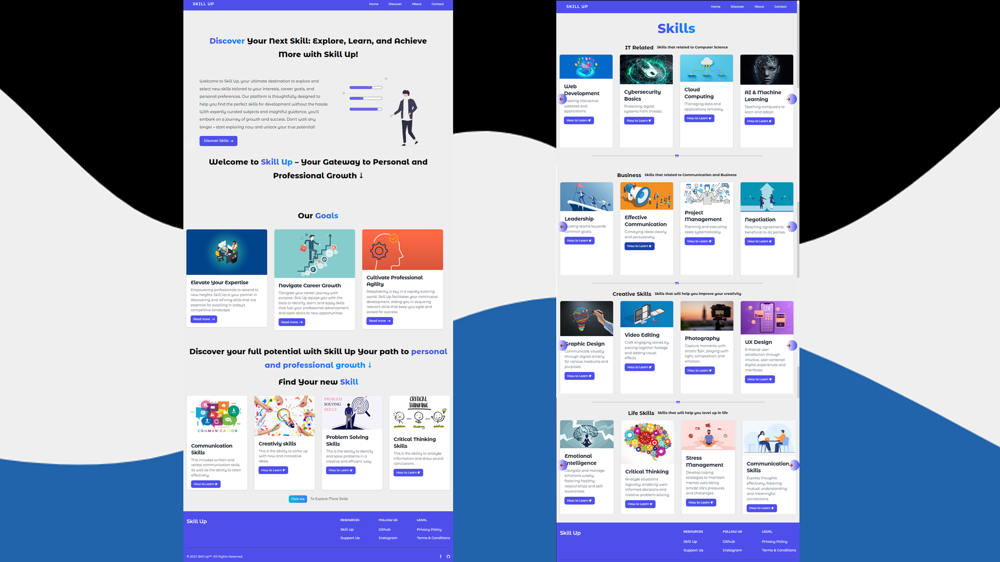

# Skill Up: Discover, Learn, and Achieve More! (Beta Release) 🌟🌟🌟

Welcome to Skill Up, your ultimate companion on the journey of personal and professional growth. Unlock your full potential, explore new horizons, and take charge of your learning experience with Skill Up's comprehensive platform.

## Find Your New Skill 🔍
Explore a world of knowledge and discover the skills that are most relevant to your aspirations. Skill Up's intuitive search and recommendation system will guide you in finding the perfect skill to tackle next. Say goodbye to indecision and hello to your new passion!

## Explore a World of Knowledge 🌍
Embark on an adventure of knowledge exploration! Skill Up offers a vast library of courses, tutorials, and learning materials, curated to cater to a wide range of interests and aspirations. From programming and design to wellness and arts, you'll find resources to nurture your curiosity.

## Getting Started 🚀
The application is still a work in progress. ❌ ❌ ❌ ❌

### Links (Beta)

- Live Web Deploy: [Netlify](https://skill-up-web-beta.netlify.app)

- App URL: [Github](https://github.com/shaheen7a/SkillUp--Cross-Platform-Application-v1.0)

## Screenshots

### Built with
- React JS (Vite)
- MUI
- React Emotions
- React Router DOM
- Infinite React Carousel
- Heroicons
- Tailwinds
- JSX

## Author 👩‍💻
- Linkedin - [@aous-shaheen-381636221](https://www.linkedin.com/in/shaheen2001/)
- Facebook - [@aoushaheen7](https://www.facebook.com/shaheen72001/)

I appreciate your interest in Skill Up Stay tuned for future updates and the official release of the app. If you have any questions or feedback, feel free to reach out. 😊🚀
